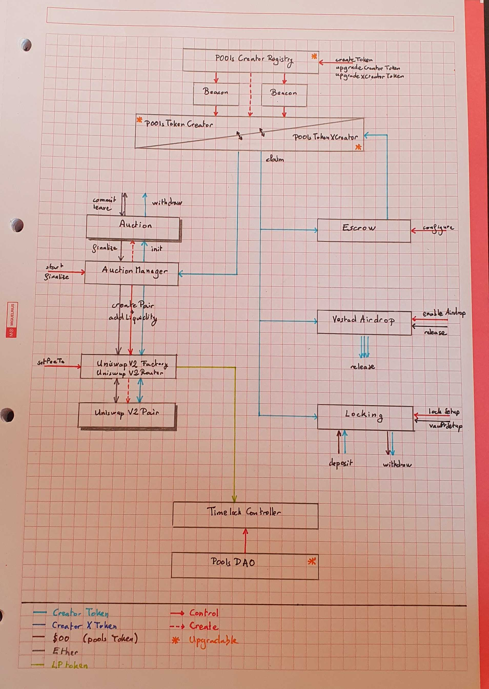

# Introduction

This repo contains the smart contract for the [p00ls](https://www.p00ls.io/) platform.

Some parts of these contracts are still being worked on and might change. See the [status](#Status) section below.

# Setup

## Environment

The development and test environments are configured through environment variables. It is recommended to configure that using a `.env` file. The `.env.example` provides an example of such file, with the different variables listed.

The main variables used are:

- **MODE**: use production to enable optimization
- **REVERT_STRINGS**: if set to strip, this option removes all the revert reasons
- **XXX_NODE**: rpc endpoint for chain `XXX` (for migration scripts)
- **MNEMONIC**: mnemonic of the wallet to use (for migration scripts)
- **PRIVATE_KEY**: private key of the wallet to use (for migration scripts)

If both `MNEMONIC` and `PRIVATE_KEY` are defined, `MNEMONIC` will take priority.

- **COVERAGE**: enable the coverage plugin (needed to produce coverage reports)
- **REPORT**: enable the gas report plugin (will produce gas usage reports when running the tests)
- **DEBUG**: add extra debug. Set `DEBUG=migration` for extra verbosity during deployments.

## Contract configuration

The contract deployment script takes its parameters from the `scripts/config.js` file. This file contains can be used to customize the deployment. If anyone wants to perform a deployment of these contracts, it is strongly encouraged to read the deployment script AND do test deployments.

# Compile

To compile the contract smart contracts, run

```
npm run compile
```

# Run tests

- Tests are run using the following command

```
npm run test
```

- Gas usage report can be produced by adding `REPORT=true` to the command line or to the `.env` configuration file

- Code coverage report can be produced by adding `COVERAGE=true` to the command line or to the `.env` configuration file and running

```
npm run coverage
```

# Deploy

In other to deploy these contracts, one should fill two different files:

- the `.env` file must contain credentials (private key or mnemonic) and an url endpoint for the targeted blockchain.
- the `scripts/config.js` file must contain the deploying arguments for the contracts (name, symbol, ...).

See the [setup](#Setup) section to learn more about the environment configuration.

Once the settings are configured, you can use the `scripts/migrate.js` script with the following command:

```
npx hardhat run scripts/migrate.js --network <blockchain-name>
```

The migration script will produce a `.cache-<chainId>.json` file containing the addresses of the deployed contracts.

Note: the deployment workflow is still being worked on.

# Architecture



# Status

| Contract name                                                     | Status           | Audited   | Deployment | Upgradeable        |
|-------------------------------------------------------------------|------------------|-----------|------------|--------------------|
| [P00lsCreatorRegistry](contracts/tokens/P00lsCreatorRegistry.sol) | Finalized        | [^1] [^2] | [Proxy](https://etherscan.io/address/0x7335db10622eecdeffadaee7f2454e37aedf7002) - [Implementation](https://etherscan.io/address/0xa5dd6c67a479c87cf8274cda565dafb285ced406) | :heavy_check_mark: |
| [P00lsTokenCreator](contracts/tokens/P00lsTokenCreator.sol)       | Finalized        | [^1] [^2] | [Implementation](https://etherscan.io/address/0x88C3E2AC77fCd790FfC2CBb0F10f20776851e2E2) | :heavy_check_mark: |
| [P00lsTokenXCreator](contracts/tokens/P00lsTokenXCreator.sol)     | Deprecated       | [^1]      | [Implementation](https://etherscan.io/address/0xB1C32d552aFf1498D2B5544cc2a5734A796ECe97) | :heavy_check_mark: |
| [P00lsTokenXCreatorV2](contracts/tokens/P00lsTokenXCreatorV2.sol) | Finalized        |      [^2] | [Implementation](https://etherscan.io/address/0x1924ef9793D17F7073D2B452A41B49c579a82d5c) | :heavy_check_mark: |
| [AMM Router](contracts/finance/amm/UniswapV2Router02.sol)         | Finalized        | [^1] [^2] | [Instance](https://etherscan.io/address/0x537c356E9cd3BC88C10E3899F623704FdD80841A) | :x:                |
| [AMM Factory](contracts/finance/amm/UniswapV2Factory.sol)         | Finalized        | [^1] [^2] | [Instance](https://etherscan.io/address/0x93F9a2765245fBeF39bC1aE79aCbe0222b524080) | :x:                |
| [AMM Pair](contracts/finance/amm/UniswapV2Pair.sol)               | Finalized        | [^1] [^2] | [Implementation](https://etherscan.io/address/0x4A4efa663f98080227B0c8613976F985f2525d60) | :x:                |
| [AuctionFactory](contracts/finance/auction/AuctionFactory.sol)    | Finalized        | [^1] [^2] | [Instance](https://etherscan.io/address/0xa5f6FCCD9dC4BF0512BB9DDd9489D1800bCA9af4) | :x:                |
| [Auction](contracts/finance/auction/Auction.sol)                  | Finalized        | [^1] [^2] | [Implementation](https://etherscan.io/address/0x98fd9F656f7a48Af0B538B755C33E3F163Eb9819) | :x:                |
| [VestedAirdrops](contracts/finance/vesting/VestedAirdrops.sol)    | Finalized        | [^1] [^2] | [Instance](https://etherscan.io/address/0x9fD7B5BE060bD5961fB645B6A5F93c1C05f55AFa) | :x:                |
| [VestingFactory](contracts/finance/vesting/VestingFactory.sol)    | Finalized        |      [^2] | [Instance](https://etherscan.io/address/0xDE09B87e50F65031DF6A3C3AA0E2f0EfCE5E2Cf6) | :x: |
| [Escrow](contracts/finance/staking/Escrow.sol)                    | Finalized        | [^1] [^2] | [Instance](https://etherscan.io/address/0x86bb69b6fB0395ECd1ACDABf292968Ac3754F7fb) | :x:                |
| [Locking](contracts/finance/locking/Locking.sol)                  | Work in progress | [^1]      | -          | :x:                |
| [DAO Timelock](contracts/dao/P00lsTimelock.sol)                   | Finalized        | [^1] [^2] | -          | :x:                |
| [DAO Governor](contracts/dao/P00lsDAO.sol)                        | Finalized        | [^1] [^2] | -          | :heavy_check_mark: |

[^1]: [Zokyo audit](audit/20220214_ZokyoAudit.pdf)
[^2]: [Byterocket audit](audit/20220816_ByterocketAudit.pdf)